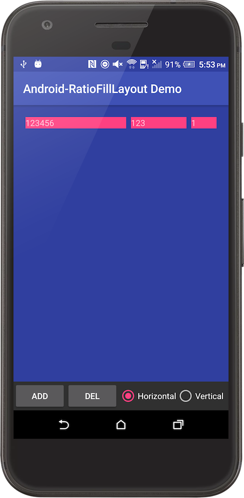

Android-RatioFillLayout
============================

A custom layout that fills given width or height as per the original ratio of each child.

If given width or height is exceeded, it largely replicates the behavior of `LinearLayout`.

#### What `RatioFillLayout` offers:
* Orientation: `horizontal`, `vertical`
* Gravity: `top`, `bottom`, `left`, `right`, `center_horizontal`, `center_vertical`



Usage
-----
```gradle
dependencies {
    compile 'com.github.bosphere.android-ratiofilllayout:ratiofilllayout:1.0.0'
}
```

```xml
<com.bosphere.ratiofilllayout.RatioFillLayout
    xmlns:app="http://schemas.android.com/apk/res-auto"
    android:layout_width="match_parent"
    android:layout_height="match_parent"
    app:rfl_orientation="horizontal"
    app:rfl_gravity="center_vertical">
    
    <TextView
        android:layout_width="wrap_content"
        android:layout_height="wrap_content"
        android:text="123456"/>

</com.bosphere.ratiofilllayout.RatioFillLayout>
```

Compatibility
-------------

API 11 (Android 3.0) and up

License
-------

Copyright 2017 Yang Bo

Licensed under the Apache License, Version 2.0 (the "License");
you may not use this file except in compliance with the License.
You may obtain a copy of the License at

   http://www.apache.org/licenses/LICENSE-2.0

Unless required by applicable law or agreed to in writing, software
distributed under the License is distributed on an "AS IS" BASIS,
WITHOUT WARRANTIES OR CONDITIONS OF ANY KIND, either express or implied.
See the License for the specific language governing permissions and
limitations under the License.
